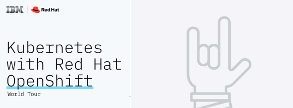

# Cloud-Native-to-Containers
This is a repository with course content that gets you started with Cloud Native ramping up to containerization

The course begins with a live hands-on lab and then proceeds as self-paced course. After the lab, every week you will receive a new section you will be expected to complete during the week before you receive details for the next section. Links will be live as we progress each week.

# Topics

1. [Pre-reads](https://github.com/IBM-Developer-Advocacy-India/Cloud-Native-to-Containers#pre-reads)
2. [Pre-requisites for live hands-on](https://github.com/IBM-Developer-Advocacy-India/Cloud-Native-to-Containers#Pre-requisites-for-live-hands-on)
3. Cloud 101
4. Cloud 201
5. Cloud 301
6. Cloud 401
7. Certification

## Pre-reads

To understand the topics we would be talking in depth in the hands-on lab on day 1, here are a few videos that will get you upto speed. 

### Intro to Cloud Native

Cloud native applications are composed of reusable components known as microservices and are designed to integrate into any cloud environment. This flexible and scalable approach is ideal for enterprises who are tasks with improving existing applications, building new applications, and enhancing user experience.

Check out this quick overview video that goes through a cloud infrastructure architecture and explains how 

### What is Public Cloud?

Public cloud provides developers with the ability to provision resources on demand and only pay for what you use, but what makes up a public cloud?

Check out this quick overview video that provides an overview of public cloud by explaining the different compute solutions, levels of control, and capabilities that are all available in a public cloud.

### Containers vs VMs

Optional: [In depth: Containers Vs. VMs](https://developer.ibm.com/articles/true-benefits-of-moving-to-containers-1/?mhsrc=ibmsearch_a&mhq=containers%20vms)

### Containerization Explained

### Cloud Native DevOps

## Pre-requisites for live hands-on
